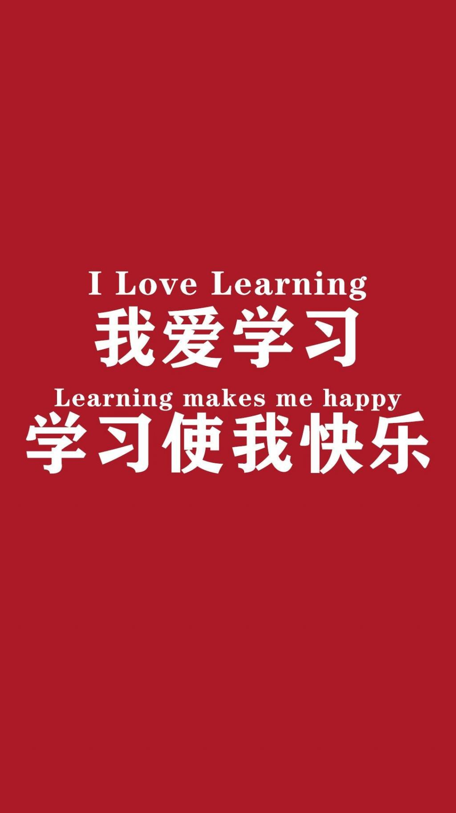

# Rust中文社群线上学习室 ｜ 通过 Rustlings 学 Rust 系列

- [ 20211213 第一期](./Logs/20211213.md)

## 动机

想要帮助 Rust 新手过一遍语法基础，以看懂 Rust 代码为目标。面向下列人群：

1. 《Rust 编程之道》和 极客时间视频教程 的读者/观众们，因为在学习我的书和视频之前需要对 Rust 的语法有一定的了解。
2. 有很多人因为 Rust 语法就放弃 Rust，我认为不至于。
3. 为《Rust 编程之道》第二版编写积累素材。希望在和新人的互动中，进一步了解新手的痛点。
4. 对这次活动感兴趣的任何人，欢迎参与交流讨论。

## 时间

每周抽几个晚上的 21:30 ～ 22:30 ，无法参与的，会有录屏。

但是希望大家尽可能的参与。有参与才有互动，有互动才有火花。

## 费用

完全免费。

## 如何加入飞书的Rust 中文社群? 

详情：[https://github.com/ZhangHanDong/rust-code-reading-club/issues/1](https://github.com/ZhangHanDong/rust-code-reading-club/issues/1)
